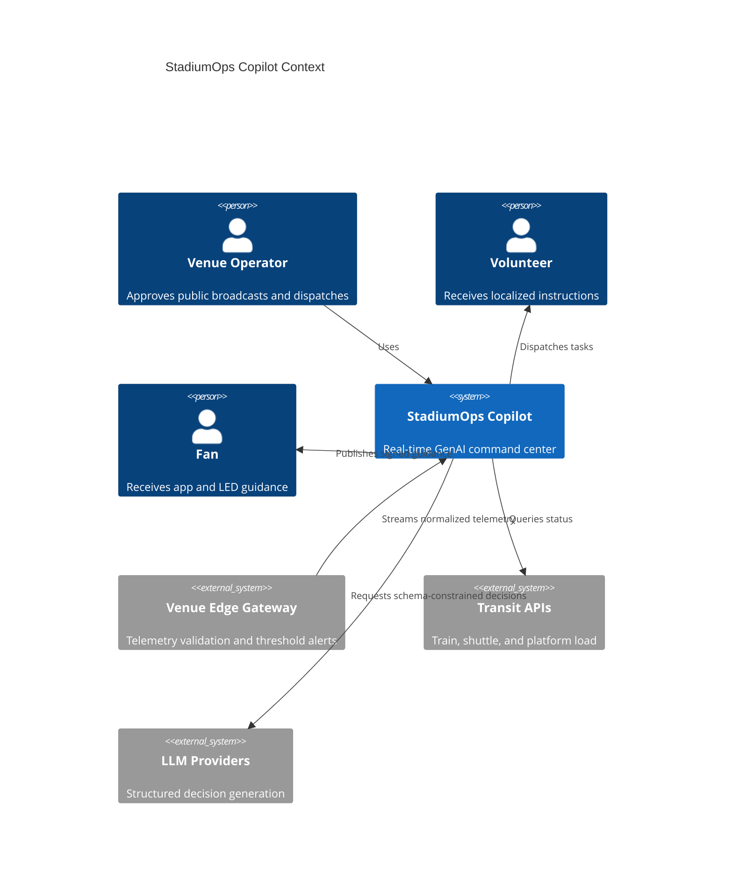
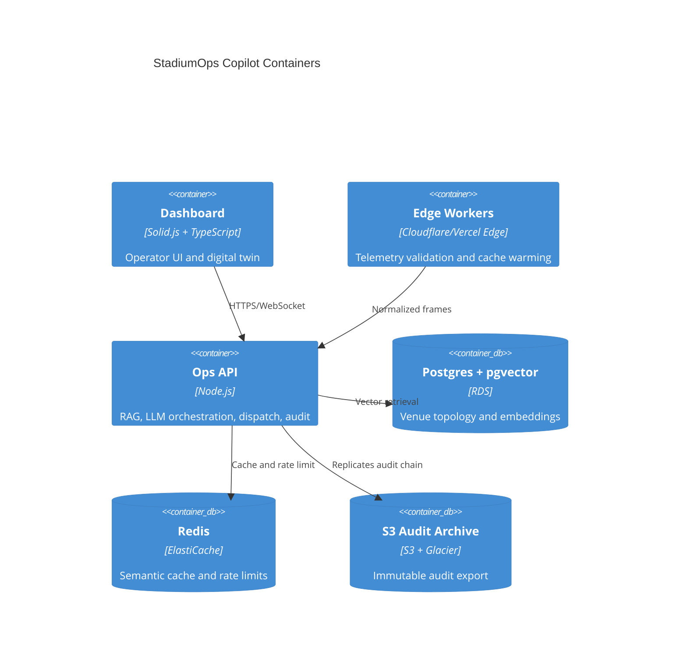
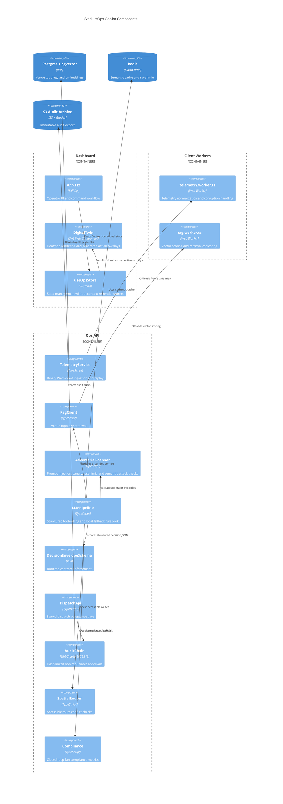

# Architecture

## Goals

StadiumOps Copilot is a real-time operational intelligence system for FIFA World Cup 2026 venues. It prioritizes safety, accessibility, observability, and human-approved public action.

## C4 Context

## C4 Container

## C4 Component

## Code-Level Contracts

- `TelemetryFrameSchema` rejects malformed sensor frames before state update.
- `DecisionEnvelopeSchema` rejects unsafe strings, invalid actions, malformed cache keys, and missing dispatch locks.
- `AuditChain` fails closed if WebCrypto is unavailable.
- `LLMPipeline` falls back to local rulebook when latency exceeds 3 seconds or guardrails block generation.
- `DigitalTwin` maps generated actions onto the SVG to reduce operator cognitive load.

## Scaling Across 16 Venues

- Venue-local edge gateways normalize telemetry.
- Central Ops API keeps deterministic state machines available for degraded network modes.
- Semantic cache uses structured density bands to reuse decisions across near-identical crowd patterns.
- Audit chain exports to S3 with lifecycle retention and Glacier archival.
